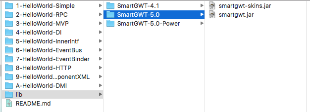
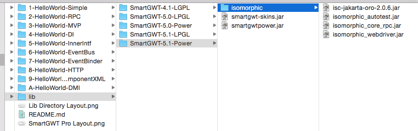

Here are some very small demonstration projects which show the various level of implementing dependency injection, loose coupling and event bus in GWT using a 'HelloWorld' like application which get its response from a server. No need to actually build and run walking through the source is simple enough to follow.

There is also an example of testing anonymous inner classes with Mockito.

For demos **1** through **8** you need to download the LGPL licensed SmartGWT framerwork from Isomophics.com and copy the two Jar files, _smartgwt-skins.jar_ and _smartgwt.jar_ into _lib/SmartGWT-X.x_ in the root of this project, where X.x is the version number of the framework, e.g. 5.0 as shown below.

For demos **9** and **A** you will need the distribution for the Pro verison or better. Isomorphics.com offers a full version trial.

**1-HelloWorld-Simple** -- A button and alert tied together in the same class. Very JavaScript-like.  Not testable, no scaleable

**2-HelloWorld-RPC** -- Uses GWT Remote Procedure Call to get a server response. Also not testable or scalable.

**3-HelloWorld-MVP** -- Builds on the RPC example but uses the Model-View-Presenter (MVP) pattern. Still not testable because of lack of interfaces, but starting to show scalability by splitting out the responsibilities.

**4-HelloWorld-DI** -- Continuing to build on RPC and MVP examples and now using interfaces with dependency injection using Google GIN. However, the number of files has doubled because each interface is its own file yet contains very little content.  With interfaces in place we can now start to do some serious testing with Mockito.

**5-HelloWorld-InnnerIntf** -- Same as '04' but the interfaces have been moved inside of the Presenter class (HelloWorldPresenter). The interface files are gone and the Presenter constructor has been cleaned up.  The Presenter is now the main focus of the coding effort while the view is simply a collection of widgets and the model acts as both a gateway to the service and a POJO.

**6-HelloWorld-EventBus** -- Not a useful example of MVP but this demo illustrates how to create and send and receive events via an application wide Event Bus.  Here the model is optional but was kept as a POJO.  Also note in this example that the error event is consumed by both the HelloWorldPresenter and the ErrorPresenter classes. Also notice that the ErrorPresenter defines both View and Model inner interfaces but does not implement them -- Loose coupling in action.

**7-HelloWorld-EventBinder** -- Building the **EventBus** project but uses the GWTEventBinder class and annotation to make the EventBus and its events much easier to work with.

**8-HelloWorld-HTTP** -- Continuing with the **EventBinder** project but using a simple HTTP POST to access the server but using SmartGWTs RPCManager so that transactions can be see in the SmartClient Console. Use the *bug* icon button to bring up the SmartClient Console, then use the RPC tab.

**9-HelloWorld-ComponentXML** -- continuing with the **HTTP** project but using the SmartGWT ComponentXML to build the container and buttons of the view. **NB** An IconButton could not be instanced via ComponentXML. 

**A-HelloWorld-DMI** -- Build on previous demos but uses Isomorphics *DMI*, Direct Method Invocation, to implement the client/server communications. Use the SmartClient Console to view the request and response data. 

--will gilbert

